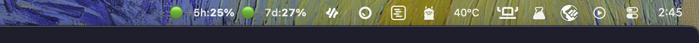
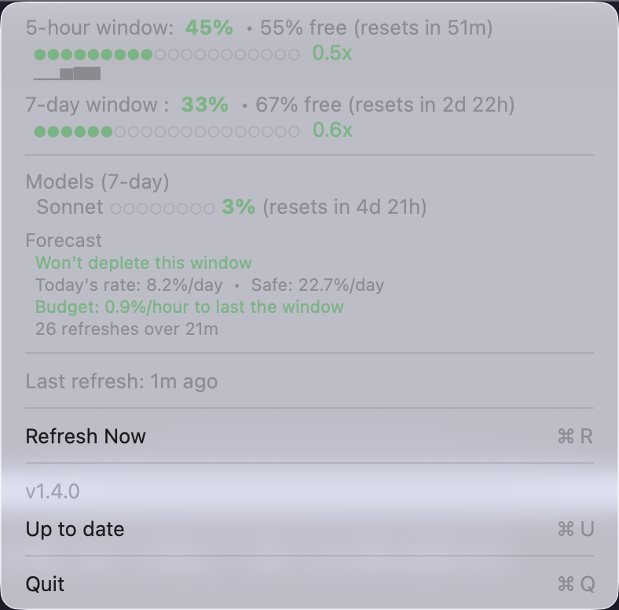

# CCUsage

[](https://www.apple.com/macos/)
[](https://swift.org)
[](https://github.com/viktor-svirsky/ccusage)
[](https://github.com/viktor-svirsky/ccusage/releases/latest)
[](https://github.com/viktor-svirsky/homebrew-ccusage)

macOS menu bar app that shows Claude Code usage limits (5-hour and 7-day windows) at a glance — with pace-aware colors, model breakdown, live agent tracking, depletion forecasts, and budget pacing.

<p align="center">
  
  <br>
  
</p>

## Features

### Menu Bar

`51/61⚡2` — compact 5-hour / 7-day utilization percentages with active session indicator (`⚡N`). Each number is color-coded:

| Color | Meaning |
|-------|---------|
| Green | <50% utilization (adjusted by pace) |
| Yellow | 50–79% utilization |
| Red | 80%+ utilization |

Colors account for spending pace — e.g. 40% on day 1 of 7 shows red because you're ahead of budget.

### Dropdown

The dropdown menu shows all usage details organized into sections:

#### 5-hour window
- Utilization percentage (bold, color-coded)
- Remaining percentage free
- Reset countdown (e.g. "resets in 4h 11m")
- Progress bar (`●●○○○○○○○○○○○○○○○○○○`)
- Pace indicator (e.g. `0.6x` — your spend rate relative to a uniform budget)
- Sparkline chart (`▁▂▃▄▅▆▇█`) showing recent utilization trend from session history

#### 7-day window
- Same fields as 5-hour window (utilization, remaining, reset, progress bar, pace, sparkline)

#### Models (7-day)
- Per-model breakdown: Opus, Sonnet, OAuth apps, Cowork
- Each model shows a mini progress bar + utilization percentage + reset countdown
- Extra usage status (if enabled on your plan)
- Hidden when no model data is available

#### Sessions
- Live tracking of all active Claude Code sessions across projects
- Each session shows: project name, model (e.g. Opus 4.6), total tokens, context window usage (e.g. `71K/200K ctx`)
- Active task name with duration (e.g. `✓ Design full Sentry coverage plan  4m23s`)
- Shell command count per session
- Hidden when no active sessions

#### Activity
- **Weekly chart** (`▁ ▃ ▇ ▅ ▄ ▂ ▁`) — per-day usage over the last 7 days, persisted to disk and synced across devices via iCloud Drive
- Day labels below (`T F S S M T W`)
- **Today's heatmap** (`▁▁▁▃▅▇▆▅▃▂▁▁▁▁▂▅▇▇▆▃▁▁▁▁`) — which hours have the most usage (session-scoped, appears after 3+ usage increases)

#### Forecast
- **Depletion estimate** — when each window will hit 100% at current rate, or "Won't deplete this window" (green) if safe
- **Daily rate** — current spend rate vs sustainable rate per day (e.g. "8.3%/day · Safe: 22.9%/day")
- **Budget advice** — how much you can spend per hour to last the window
- **Session stats** — refresh count and duration (after 2+ refreshes)
- **Peak hours** — most active hour of the day (after enough data)

#### Footer
- Last refresh timestamp (live-updating seconds counter for first minute)
- Refresh Now (⌘R)
- Version + update status (⌘U)
- Quit (⌘Q)

### Infrastructure
- Auto-refresh every 2 minutes + on wake from sleep
- Live "last refresh" counter — updates every second for the first minute
- Independent OAuth token refresh — works even when Claude Code isn't running
- Proactive token renewal before expiry + automatic retry on 401 with graceful degradation
- Adaptive rate-limit handling with exponential backoff (respects Retry-After, auto-refreshes OAuth token on 429)
- Session-scoped usage history (last 60 data points, ~2 hours)
- Persistent daily usage tracking with iCloud Drive sync across devices
- Auto-update from GitHub Releases — downloads and installs automatically when a `.zip` asset is available
- Registers as login item automatically

## Requirements

- macOS 13+
- Claude Code signed in at least once (OAuth token in Keychain)

## Install

### Homebrew

```bash
brew install viktor-svirsky/ccusage/ccusage
```

### From GitHub Releases

Download the latest `CCUsage.zip` from [Releases](https://github.com/viktor-svirsky/ccusage/releases), unzip, and move `CCUsage.app` to `/Applications`.

### From source

```bash
make install
```

## Build & Test

```bash
make test    # run 608 unit tests
make build   # compile .app bundle
```

## Uninstall

```bash
brew uninstall ccusage        # if installed via Homebrew
make uninstall                # if installed from source
```

## Creating a Release

Trigger the release workflow manually:

```bash
gh workflow run Release -f version=1.2.0
```

This runs tests, builds the app with the specified version, creates a git tag, publishes a GitHub Release with the `.zip` artifact, and updates the [Homebrew tap](https://github.com/viktor-svirsky/homebrew-ccusage) automatically.
