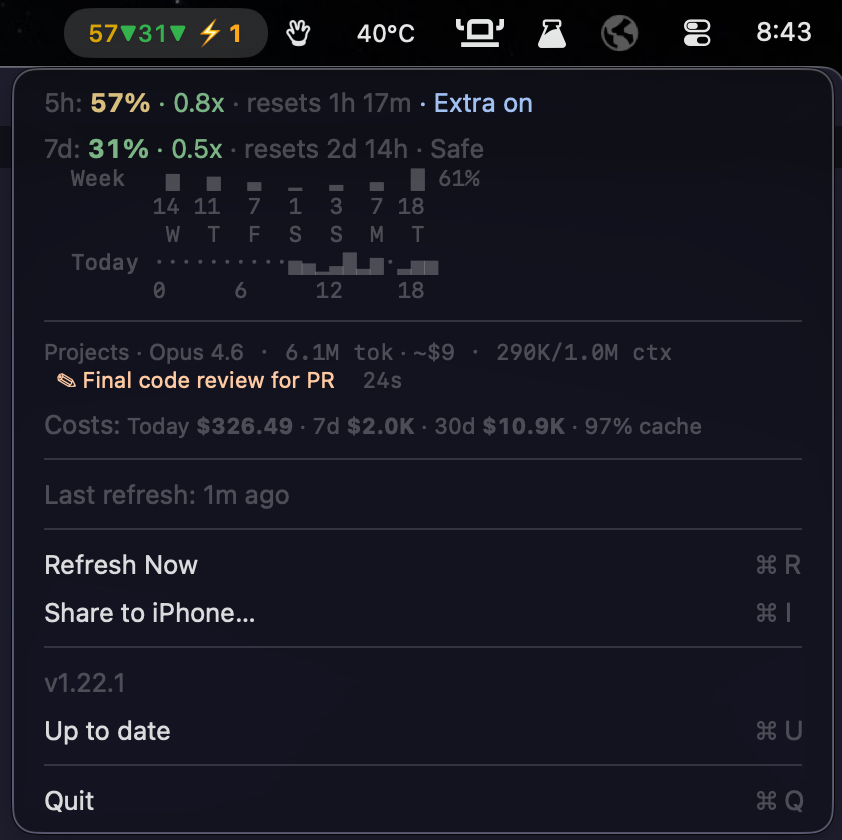

# CCUsage

[](https://www.apple.com/macos/)
[](https://swift.org)
[](https://github.com/viktor-svirsky/ccusage)
[](https://github.com/viktor-svirsky/ccusage/releases/latest)
[](https://github.com/viktor-svirsky/homebrew-ccusage)

macOS menu bar app that shows Claude Code usage limits (5-hour and 7-day windows) at a glance — with pace-aware colors, live agent tracking, depletion forecasts, Codex integration, and an iOS widget.

<p align="center">
  
  <br>
  
</p>

## Features

### Menu Bar

`61●31▼` — compact 5-hour and 7-day utilization with per-window pace indicators. Numbers and arrows are color-coded. When agents are running, `⚡N` is appended.

| Element | Green | Yellow | Red |
|---------|-------|--------|-----|
| Numbers | <50% | 50-79% | 80%+ |
| Arrows | ▼ under budget | — | ▲ over budget |

### Dropdown

#### Usage
- **5h line**: `5h: 57% · 0.8x · resets 1h 17m · Extra on` — utilization (color-coded), pace (green=under, red=over), reset time, extra usage (blue)
- **7d line**: `7d: 31% · 0.5x · resets 2d 14h · Safe` — same format with inline forecast (Safe=dim, Depletes=orange, Depleted=red)
- **Weekly chart** — per-day usage bars over the last 7 days with daily percentages
- **Today heatmap** — hourly activity visualization

#### Sessions
- Live tracking of all active Claude Code and Codex sessions
- Each session: project name, model, tokens, estimated cost, context window usage
- Active agent shown with pencil icon and duration (e.g. `✎ Review code  12s`)
- Hidden when no active sessions

#### Costs
- `Costs: Today $48 · 7d $1.0K · 30d $11.0K · 99% cache` — estimated token costs with cache hit rate

#### Footer
- Last refresh timestamp (live-updating seconds counter)
- Refresh Now, Share to iPhone, version/update status, Quit

### iOS Widget

Syncs usage data to an iPhone widget via a Cloudflare Worker. Supports small, medium, and lock screen widgets (circular, rectangular, inline).

Setup: Click "Share to iPhone..." in the Mac menu, scan the QR code with the iOS app.

### Infrastructure
- Auto-refresh every 2 minutes + on wake from sleep
- Live "last refresh" counter — updates every second for the first minute
- Independent OAuth token refresh — works even when Claude Code isn't running
- Proactive token renewal before expiry + automatic retry on 401 with graceful degradation
- Adaptive rate-limit handling with exponential backoff (respects Retry-After, auto-refreshes OAuth token on 429)
- Session-scoped usage history (last 60 data points, ~2 hours)
- Persistent daily usage tracking with iCloud Drive sync across devices
- Auto-update from GitHub Releases — downloads and installs automatically when a `.zip` asset is available
- Registers as login item automatically

## Requirements

- macOS 13+
- Claude Code signed in at least once (OAuth token in Keychain)

## Install

### Homebrew

```bash
brew install viktor-svirsky/ccusage/ccusage
```

### From GitHub Releases

Download the latest `CCUsage.zip` from [Releases](https://github.com/viktor-svirsky/ccusage/releases), unzip, and move `CCUsage.app` to `/Applications`.

### From source

```bash
make install
```

## Build & Test

```bash
make test    # run ~778 unit tests
make build   # compile .app bundle
```

## Uninstall

```bash
brew uninstall ccusage        # if installed via Homebrew
make uninstall                # if installed from source
```

## Creating a Release

Trigger the release workflow manually:

```bash
gh workflow run Release -f version=1.2.0
```

This runs tests, builds the app with the specified version, creates a git tag, publishes a GitHub Release with the `.zip` artifact, and updates the [Homebrew tap](https://github.com/viktor-svirsky/homebrew-ccusage) automatically.
